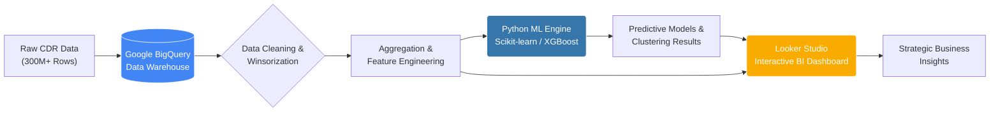
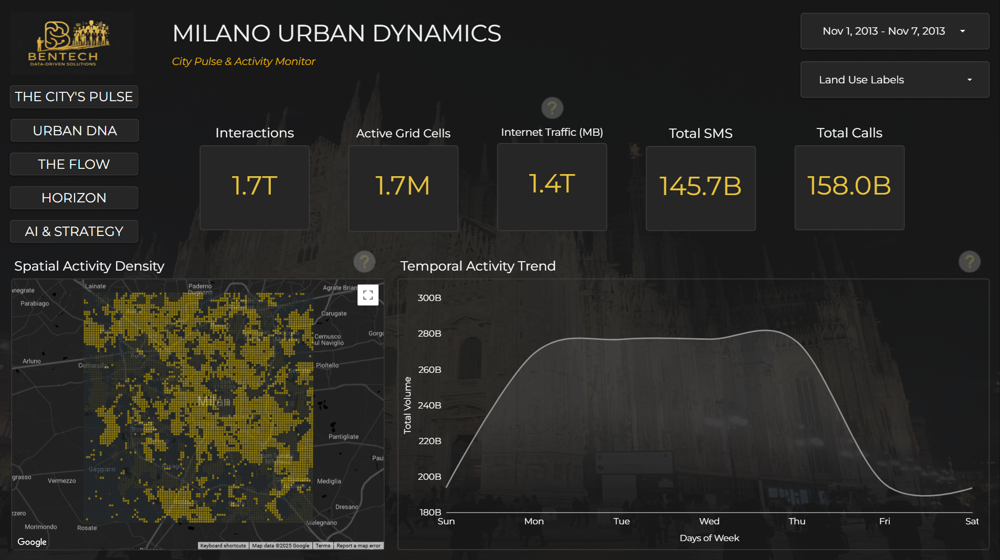
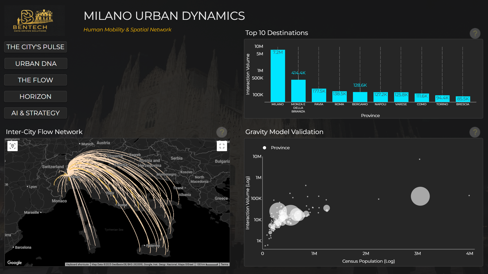
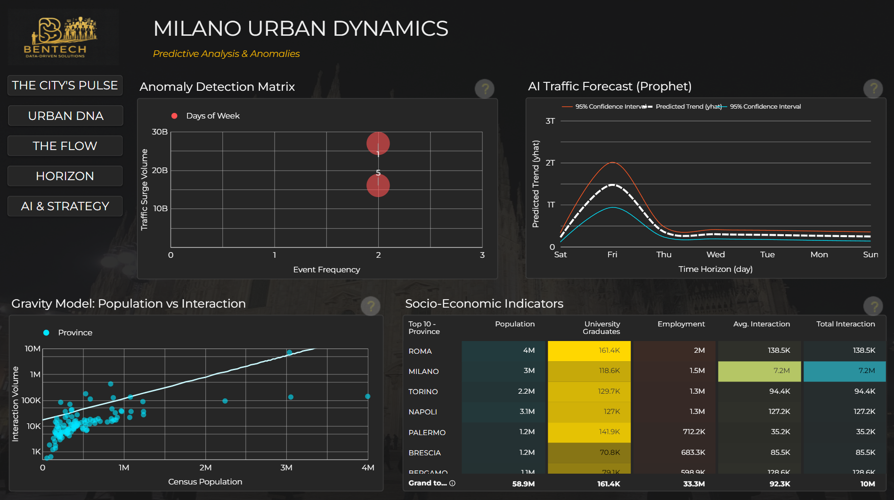

<div align="center">
  
  
  <br><h1>🏙️ Milano Urban Dynamics:<br>AI-Driven Telecom Analysis & Strategic Tariff Optimization</h1>

  <p>
    <b>From Big Data to Business Strategy:</b> Decoding the digital pulse of Milan using <b>300 Million+</b> telecom records to forecast urban traffic, uncover hidden socioeconomic patterns, and engineer a data-driven product strategy.
  </p>

  <a href="https://www.python.org/"></a>
  <a href="https://cloud.google.com/bigquery"></a>
  <a href="https://lookerstudio.google.com/"></a>
  
  
  

  <br><br>
  <a href="https://lookerstudio.google.com/reporting/0526f4db-049e-420b-9ba0-242231d8311a"><strong>🖥️ View Live Dashboard</strong></a> |
  <a href="https://drive.google.com/uc?export=download&id=11Zcj_B1pA50UvyGRQSdN19N_3wa4Ns0i"><strong>📄 Download Technical Report (PDF)</strong></a> |
  <a href="notebooks/"><strong>🛠️ Explore Code</strong></a>
</div>

---

## 📋 Table of Contents

- [📍 Executive Summary](#-executive-summary)
- [💼 Business Context & Problem Statement](#-business-context--problem-statement)
- [🏗️ Solution Architecture](#%EF%B8%8F-solution-architecture)
- [🧠 Technical Methodology](#-technical-methodology)
  - [1. Urban Structure Decoding](#1-urban-structure-decoding-unsupervised-learning)
  - [2. Predictive Modelling](#2-predictive-modelling-forecasting)
  - [3. Deep Insights](#3-deep-insights-gentrification--retail)
- [💡 Strategic Outcome: Milano Smart Flex](#-strategic-outcome-milano-smart-flex)
- [📊 Dashboard Gallery](#-dashboard-gallery)
- [🛠️ Technology Stack](#%EF%B8%8F-technology-stack)
- [📂 Repository Structure](#-repository-structure)

---

## 📍 Executive Summary

**Milano Urban Dynamics** is an end-to-end data science project that leverages **Big Data Analytics** and **Machine Learning** to bridge the gap between static urban planning and dynamic human behavior.

By processing **300 Million+** Call Detail Records (CDR) from 2013, this project reveals the "invisible city"—mapping real-time population shifts, predicting network stress, and identifying socioeconomic disparities.

**Key Achievements:**
* **Data Processing:** Handled petabyte-scale data using Google BigQuery.
* **Model Accuracy:** Achieved **$R^2 = 0.996$** in hourly traffic forecasting using XGBoost.
* **Business Impact:** Identified a critical market gap (Supply: 2GB vs. Demand: 5.77GB) and formulated the **"Milano Smart Flex"** strategy to reduce churn and optimize network load.

---

## 💼 Business Context & Problem Statement

**The Problem:** In 2013, telecom operators and city planners were operating in "blind flight." Static census data failed to capture the pulse of the city, leading to inefficient infrastructure investments and rigid tariff plans that did not meet user needs.

**The Goal:** Transform the "Silent Witness" (CDR Data) into actionable intelligence to:
1.  **Map** the functional use of city zones (Business vs. Residential) without labeled data.
2.  **Forecast** network traffic to prevent outages and optimize bandwidth.
3.  **Design** a dynamic, profitable product strategy based on actual consumption behavior.

---

## 🏗️ Solution Architecture

The project follows a modern, scalable ETL and ML pipeline architecture.



## 🧠 Technical Methodology

### 1. Urban Structure Decoding (Unsupervised Learning)
Using **K-Means Clustering** on temporal signal patterns, we classified the city into functional zones without any labeled data.
* **Cluster 1 (Business Districts):** Sharp activity rise at 09:00, drop at 18:00. Identified "Hidden Office Hubs" in officially residential areas.
* **Cluster 0 (Residential):** Dual peaks (Morning/Evening).
* **Cluster 2 (Leisure/Mixed):** Sustained activity late into the night.

### 2. Predictive Modelling (Forecasting)
To optimize network resource allocation, we predicted future traffic load.
* **Algorithm:** **XGBoost Regressor** (with Prophet for trend decomposition).
* **Features:** Temporal (Hour, Day, Month), Spatial (Grid ID, Cluster Type), and Lag Features.
* **Result:** The model captured complex urban rhythms with **99.6% Accuracy ($R^2$)**, enabling proactive network management.

### 3. Deep Insights: Gentrification & Retail
Going beyond standard analysis to extract socioeconomic value:
* **Digital Gentrification Index:** Calculated the ratio of **Data Usage vs. SMS Usage**. Areas with high Data/SMS ratios were identified as "High-End/Modern" zones, correlating with higher purchasing power.
* **Retail Opportunity Heatmap:** Tracked post-event crowd dispersion (e.g., after a San Siro match), revealing that 60% of the crowd flows towards specific nightlife districts (Navigli), pinpointing prime locations for targeted advertising.

---

## 💡 Strategic Outcome: Milano Smart Flex

The core output of this analysis is a strategic product proposal designed to solve the 2013 market inefficiency. Analysis showed users consumed **3x more data** than the market standard allowed.

**The Solution:** A hybrid tariff model using "Dead Zones" (Business districts at night) as leverage.

| Feature | Market Standard (2013) | **Milano Smart Flex (Our Proposal)** | Business Value |
| :--- | :--- | :--- | :--- |
| **Price** | €15.00 / Mo | **€12.00 / Mo** | Competitive Edge |
| **Data Cap** | 2 GB (Hard Limit) | **4 GB + Smart Unlimited** | Churn Reduction |
| **Innovation** | None | **Zone-Zero & Night-Owl** | Network Load Balancing |
| **Impact** | High Overage Risk | **Customer Loyalty** | Sustainable Revenue |

> *Zone-Zero: Unlimited data in Business Clusters during office hours, utilizing idle capacity.*

---

## 📊 Dashboard Gallery

The insights are visualized in a **"Duomo Notte"** themed interactive dashboard.

| Urban Structure & Anomalies | Strategy & Model Performance |
| :---: | :---: |
|  |  |  |
| *K-Means clustering and Anomaly detection.* | *XGBoost predictions and Tariff Strategy.* |

*(Click the "View Live Dashboard" link at the top to explore interactively)*

---

## 🛠️ Technology Stack

| Domain | Technology | Use Case |
| :--- | :--- | :--- |
| **Data Warehouse** | Google BigQuery | Storage & Processing of 300M+ rows. |
| **Language** | Python 3.9+ | Data Science & ML Pipeline. |
| **ML Libraries** | Scikit-learn, XGBoost | Clustering & Regression. |
| **Data Manipulation** | Pandas, NumPy | Cleaning & Feature Engineering. |
| **Geospatial** | GeoPandas, BigQuery GIS | Spatial Analysis (WKT Polygons -> Points). |
| **Visualization** | Looker Studio | Business Intelligence Dashboard. |

---

## 📂 Repository Structure

```bash
milano-urban-dynamics/
├── README.md               # Project Documentation
├── LICENSE                 # MIT License
├── requirements.txt        # Python Dependencies
│
├── notebooks/              # Jupyter Notebooks (Run in order)
│   ├── 01_Data_Cleaning_and_Prep.ipynb
│   ├── 02_Urban_Structure_Clustering.ipynb
│   ├── 03_Mobility_Network_Analysis.ipynb
│   ├── 04_Traffic_Forecasting_XGBoost.ipynb
│   └── 05_Deep_Insights_and_Strategy.ipynb
│
├── docs/                   # Reports & Presentations
│   ├── Milano Urban Dynamics Proje Report.pdf
│   └── Milano_Telecom_Data_Analysis_—_2013_Week_Dataset.pdf
│
└── assets/                 # Images for README
    ├── dashboard_hero_banner.png
    └── dashboard_screenshot_urban.png
```